# 🧪 DevWorthy Testing

[⬅️ Back to README.md](README.md)  
[🌍 Live Site](https://anthonyradose.github.io/dev-worthy/#/)

Manual testing was conducted throughout development to ensure all features performed as expected across multiple screen sizes, user flows, and edge cases.

---

## ✅ Automated Testing

### 🧼 HTML & CSS Validation (via [W3C Validator](https://validator.w3.org/))

#### HTML

[W3C](https://validator.w3.org/) was used to validate the HTML on all pages of the site along with validation of CSS.

  
<strong>Index HTML: No Errors ✅</strong>

   
  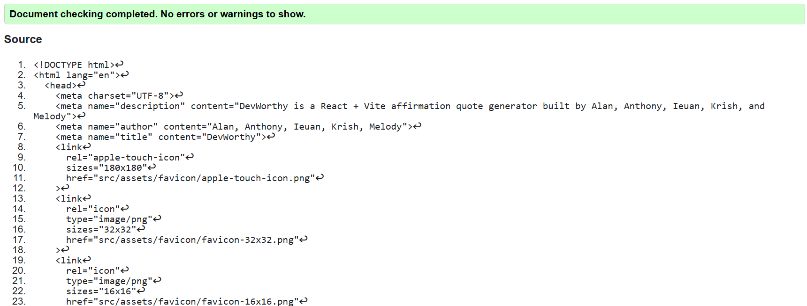

  
<strong>404 HTML: No Errors ✅</strong>

   
  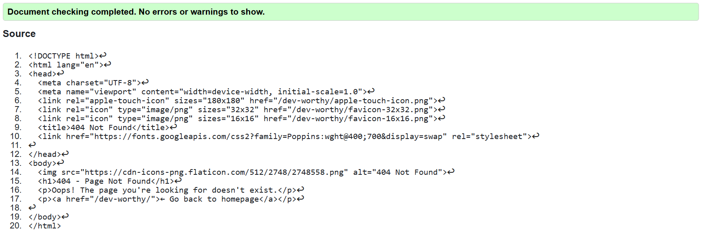

>
> #### 404 Testing notes
>At the time of testing there were elements of CSS and JS within the file.
>The HTML ONLY was tested here.
>The separation and integration of separate styling and script files may need to be implemented in >future, due to time constraints.
>

#### CSS

<strong>Credits.module.css: No Errors ✅</strong>

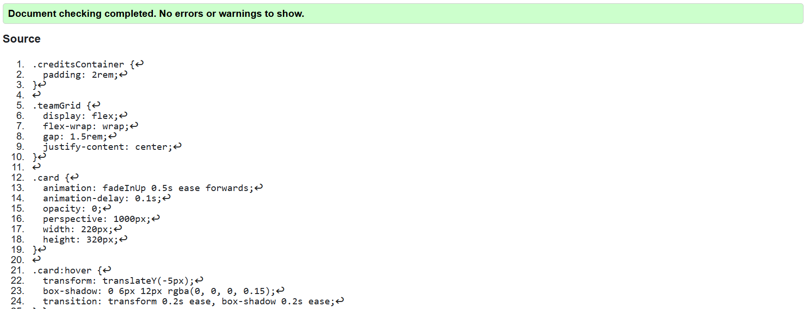

<strong>Favorites.module.css: 2x Parse errors ⚠️</strong>

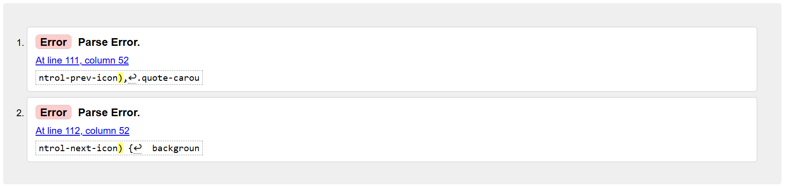

<strong>Footer.module.css: No Errors ✅</strong>

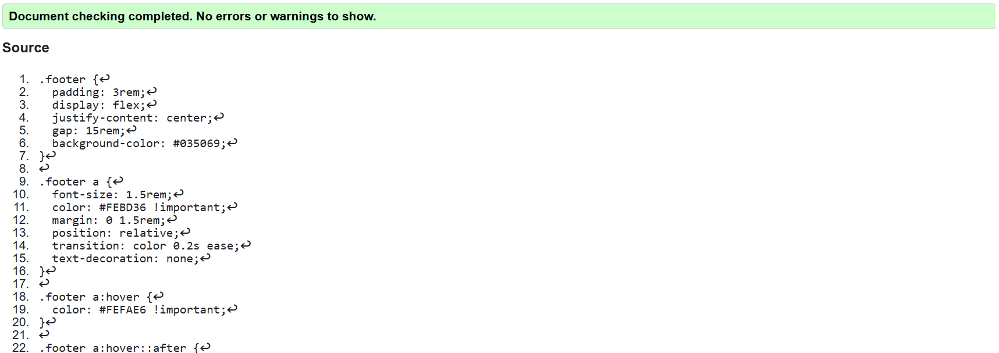

<strong>Navbar.module.css: No Errors ✅</strong>

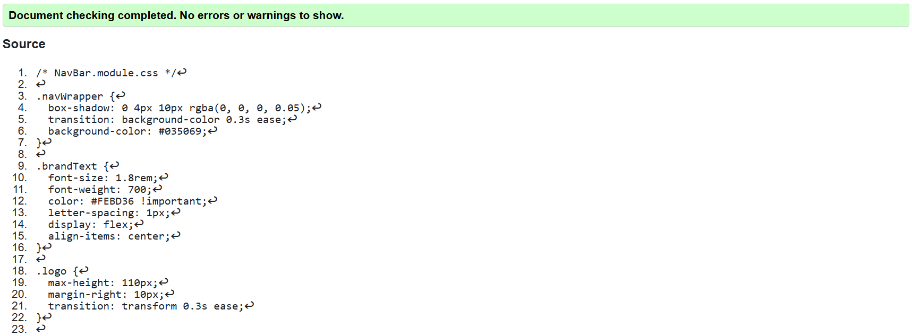

<strong>QuoteCard.module.css: No Errors ✅</strong>

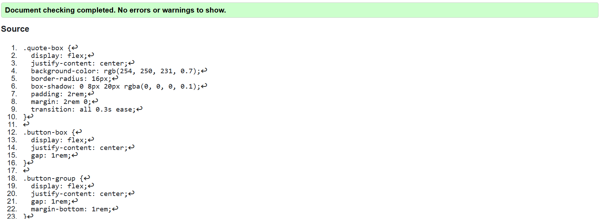

<strong>index.css: No Errors ✅</strong>

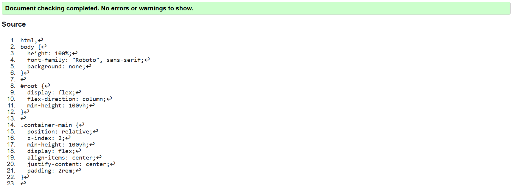

> ### ⚠️ Parse errors: Favourites.module.css  
>  
> The W3C validator reports a "parse error" in the `Favourites.module.css` file due to the use of `:global` selectors, which are specific to CSS Modules used in modern React applications.  
>  
> These selectors are intentionally used to style third-party components (e.g., carousel navigation buttons) that exist outside the scope of the local module, which is a common and supported approach in React with CSS Modules.  
>  
> The validator does not recognize this syntax because it is not part of standard CSS—it is a build-time feature handled by the React development environment (e.g., Webpack or Vite).  
>  
> ✅ The styles render correctly in all modern browsers, and removing or altering them to satisfy the validator would break essential carousel functionality and styling. Therefore, this code is valid within the context of the project and does not need to be changed.

[🔝 Back to top](#devworthy-testing)

-----

### 📜 JavaScript Validation

#### React Application Testing Overview

The React application was tested using **Vitest** and **React Testing Library**, focusing on key components and pages:

## 🔗 Test Files

- [QuoteCard.test.jsx](./src/components/QuoteCard.test.jsx)
- [Favourites.test.jsx](./src/pages/Favourites.test.jsx)
- [NotFound.test.jsx](./src/pages/NotFound.test.jsx)

---

#### 🧪 Testing Stack

| Tool | Version |
|------|---------|
| **Vitest** | v3.1.1 |
| **React Testing Library** | v16.3.0 |
| **jsdom** | v26.1.0 |
| **Router** | React Router DOM |
| **Mocking** | Vitest mocks (`vi`) |

---

#### ✅ Component Test Coverage

| Component   | Test Scenarios                                                                 | Status |
|-------------|----------------------------------------------------------------------------------|--------|
| **QuoteCard** | Initial render, fetch quotes, button functionality, saving & duplicate logic | ✅ |
| **Favourites** | Empty state, loading from `localStorage`, rendering saved quotes             | ✅ |
| **NotFound**   | Rendering of 404 content, link back to homepage                              | ✅ |

---

#### 📂 Test File Links

- [`QuoteCard.test.jsx`](../path/to/QuoteCard.test.jsx)
- [`Favourites.test.jsx`](../path/to/Favourites.test.jsx)
- [`NotFound.test.jsx`](../path/to/NotFound.test.jsx)

---

#### 🧩 Mock Implementations

- **`localStorage` Mock**: used in `Favourites` tests for simulating saved quotes.
- **`fetch` Mock**: used in `QuoteCard` to simulate quote API responses.

---

#### 🔍 Testing Approaches

- Async handling with `waitFor` and `act`
- UI assertions with `toBeInTheDocument()`
- Button click simulation with `fireEvent`
- Setup/cleanup with `beforeEach`, `afterEach`

---

#### 🛠️ Vitest Configuration

>// vitest.config.js
>import { defineConfig } from 'vitest/config';
>import react from '@vitejs/plugin-react';
>
>export default defineConfig({
>  plugins: [react()],
>  test: {
>    environment: 'jsdom',
>    globals: true,
>    setupFiles: ['./src/setupTests.js'],
>    css: true,
>  },
>});
>

📋 Best Practices Applied

✅ Isolated component testing
✅ Mocking external dependencies
✅ Asserting both UI elements and behavior
✅ Testing error and edge cases
✅ Clean test setup with beforeEach and afterEach

🔝 Back to top

-----

### 💡 Lighthouse Testing

Tested using Chrome DevTools for both **Desktop** and **Mobile** performance, accessibility, best practices, and SEO.

#### 🏠 Index Page

Index

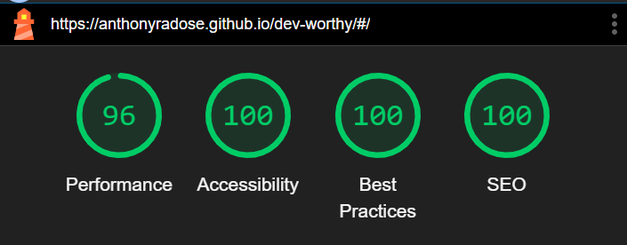

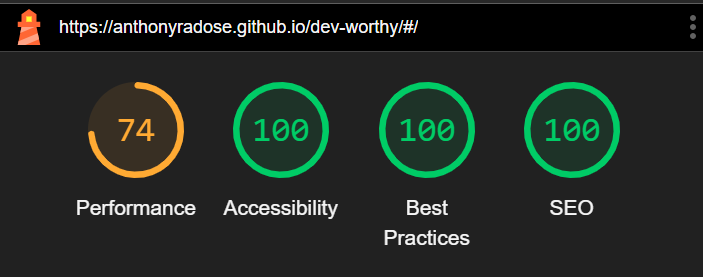

| | Performance | Accessibility | Best Practice | SEO |
| :---: | :---: | :---: | :---: | :---: |
| Desktop | 96 | 100 | 100| 100 |
| Mobile | 74 | 100 | 100 | 100 |

#### 👥 Credits Page

Credits

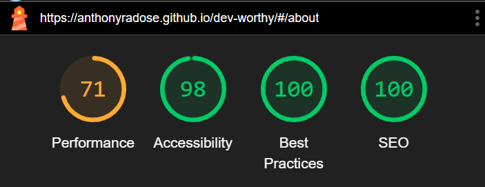

| | Performance | Accessibility | Best Practice | SEO |
| :---: | :---: | :---: | :---: | :---: |
| Desktop | 98 | 98| 100 | 100 |
| Mobile | 71 | 98 | 100 | 100 |

#### ⭐ Favourites Page

Favourites

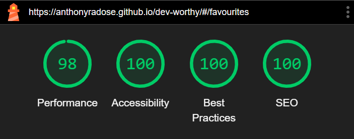

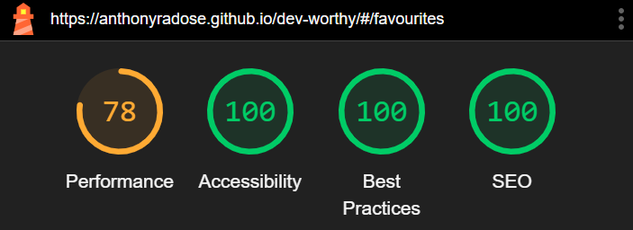

| | Performance | Accessibility | Best Practice | SEO |
| :---: | :---: | :---: | :---: | :---: |
| Desktop | 98 | 100| 100 | 100 |
| Mobile | 78 | 100 | 100 | 100 |

[🔝 Back to top](#devworthy-testing)

-----

## 🔍 Manual Testing

### ✅ Project Criteria

>#### Criteria
>
>1) The team has built one of the 5 suggested projects
>2) The team has innovated on their choice of project
>3) The project is fully responsive
>4) The project is well planned using github projects or other issues board
> 
>

| Criteria | Description | Image |
| :----: | :----: | :----: |
| __1) The team has built one of the 5 suggested projects__ | The chosen project was the daily boost app | 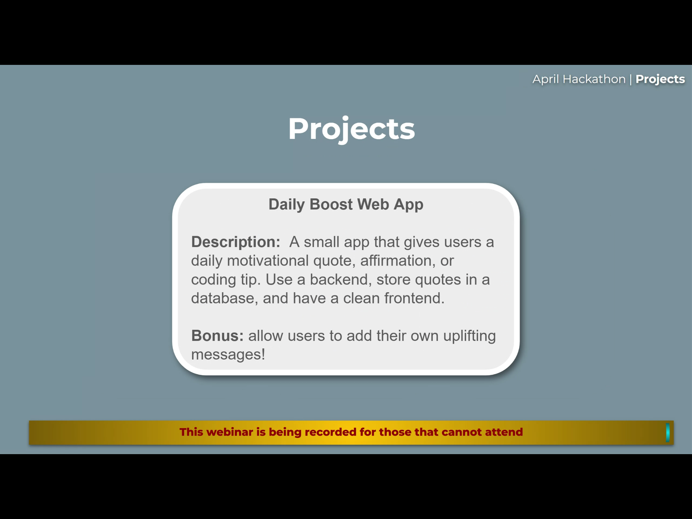 |
| __2) The team has innovated on their choice of project__ | The team has innovated in the build of the app, using react and implementing API's to generate content | 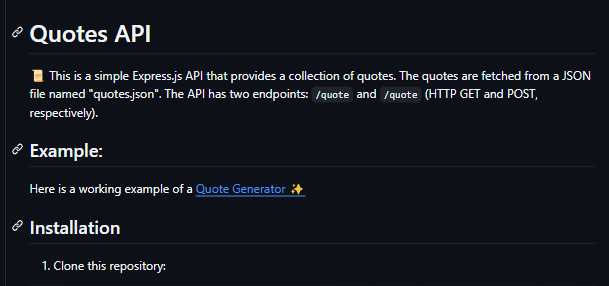  |
| __3) The project is fully responsive__ | Project is usable and appealing across all screen sizes |  |
| __4) The project is well planned using github projects or other issues board__ | Github projects has been used throughout | 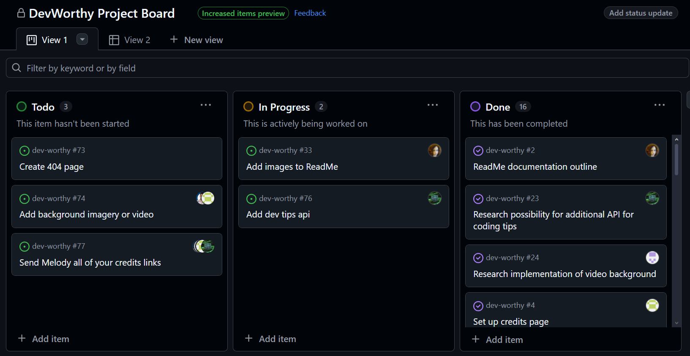 |

### 🧑‍💻 Testing User Stories

>#### User Goals
>
>- View inspiring quotes
>- View coding tips and tricks
>- Save quotes to favourites
>- View information about the team
>

| Goal | Implementation | Image |
| :---: | :---: | :---: |
| __View Inspiring quotes__ | Quotes can be viewed on the main page | 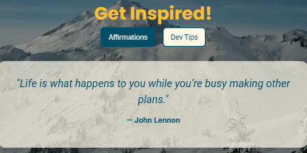 |
| __View coding tips and tricks__ | Coding tips can be viewed on the main page |  |
| __Save quotes to favourites__ | Quotes can be saves from the quotes page and viewed on the favourites page | 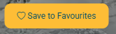 |
| __View information about the team__ | Team info can be found on the about us page | 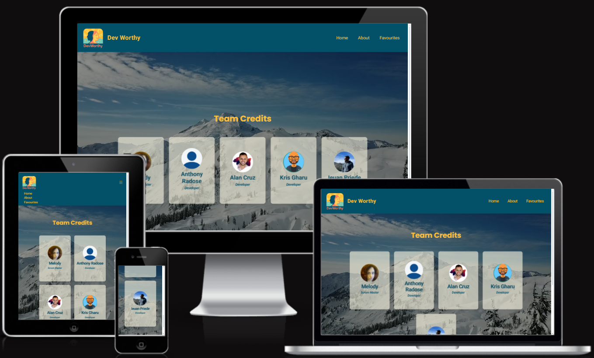| |

[🔝 Back to top](#devworthy-testing)

-----

### 🧪 Full Testing

Full testing was performed on the following devices:

* Laptop
  * Lenovo IDEAPAD Flex 5i

* Mobile
  * Samsung Galaxy S24
 
 Desktop device tested the site using the following browsers:
 
 * Google Chrome
 * Mozilla Firefox
 * Opera
 * Microsoft Edge

#### 🌐 Navbar & Layout

| Feature | Expected Outcome | Testing Performed | Result | Pass/Fail |
|----|----|----|----|----|
| Navbar Links | All links in the navbar redirect to the correct pages | Clicked each navbar link | Each link navigated to the intended section/page | ✅ Pass |
| Brand Logo | Brand logo redirects to the homepage | Clicked logo | Redirected accordingly | ✅ Pass |
| Footer Links | Links open in new tabs to GitHub | Clicked links | Links open in new tabs to GitHub profile/repos | ✅ Pass |

#### 🏠 Index Page

| Feature | Expected Outcome | Testing Performed | Result | Pass/Fail |
|----|----|----|----|----|
| Default Affirmation Load  | A random affirmation quote loads automatically on page load  | Opened the homepage | Affirmation quote displayed correctly on initial load | ✅ Pass |
| View Affirmation Quote | Affirmation quote is displayed when Affirmation tab is clicked | Clicked the Affirmation tab | Quote displayed correctly | ✅ Pass |
| View Dev Tip Quote | Dev tip quote is displayed when Dev Tip tab is clicked | Clicked the Dev Tip tab | Dev tip quote displayed correctly | ✅ Pass |
| Refresh Affirmation Tab | New affirmation appears when revisiting the Affirmation tab | Navigated to Dev Tip then back to Affirmation tab | New affirmation quote displayed | ✅ Pass |
| Refresh Dev Tip Tab | New dev tip appears when revisiting the Dev Tip tab | Navigated to Affirmation then back to Dev Tip tab | New dev tip quote displayed | ✅ Pass |
| Save Quote to Favourites | Quote is added to the Favourites section when save is clicked | Clicked save button under a displayed quote | Quote appeared in Favourites section | ✅ Pass |

#### 👥 Credits Page

| Feature | Expected Outcome | Testing Performed | Result | Pass/Fail |
|----|----|----|----|----|
| Flip Team Member Card | Card flips when clicked to reveal social links | Clicked on each team member card | Each card flipped successfully to show the back with links | ✅ Pass |
| Social Links Open Externally | Social links open in new browser tabs | Clicked on each social media icon | Each link opened the correct profile in a new browser tab | ✅ Pass |

#### ⭐ Favourites Page

| Feature | Expected Outcome | Testing Performed | Result | Pass/Fail |
|----|----|----|----|----|
| View Favourite Quotes | Saved quotes appear in a styled carousel | Visited Favourites page after saving | Carousel displayed all previously saved quotes  | ✅ Pass |
| Carousel Navigation | Users can scroll through multiple saved quotes using carousel controls | Clicked previous/next buttons | Carousel navigated smoothly between quotes | ✅ Pass |
| Remove Individual Quote | Clicking “Remove” deletes that quote from favourites | Clicked remove on a specific quote | Quote disappeared from the carousel instantly | ✅ Pass |
| Empty State Display | A message is shown when there are no favourite quotes | Removed all quotes or loaded with none   | Message like “No favourite quotes saved” shown | ✅ Pass |

#### 🚫 404 Page

| Feature | Expected Outcome | Testing Performed | Result | Pass/Fail |
| --- | --- | --- | --- | --- |
| Appears when incorrect url entered | View 404 page | Input incorrect url path | Page appears | ✅ Pass |
| Home button | User is returned to index if logged out or their profile if logged in | Click Home button | Redirected accordingly | ✅ Pass |

[🔝 Back to top](#devworthy-testing)

-----

## ♿ Accessibility Testing

✅ Site tested using Android’s **TalkBack** screen reader.  
All interactive components are readable, labelled, and navigable.

[🔝 Back to top](#devworthy-testing)

---

## 🐞 Bugs

### ✅ Solved Bugs

| # | Issue | Details | What was done | Fixed? |
| --- | --- | --- | --- | --- |
| 1 | 404 Refresh error | Any time the about or favourites pages were refreshed it would redirect to the 404 page. | Added hashrouter to main.jsx | ✅ |
| 2 | Quote rendering issue | The aspirational quotes API would not render quotes onto the devworthy page. | Review of the API code caught a class error when retreiving the information. " | ✅ |

[🔝 Back to top](#devworthy-testing)

-----

### ⚠️ Known Bugs

| #  | Issue | Details | Next Steps |
|-----|-----|-----|-----|
| 1 | Layout Issue | Mobile view on dev tools doesn't synch up with actual mobile view | To fix real mobile layout would involve coding blind and extensive manual testing outside the scope of the project timeline |

[🔝 Back to top](#devworthy-testing)

-----
